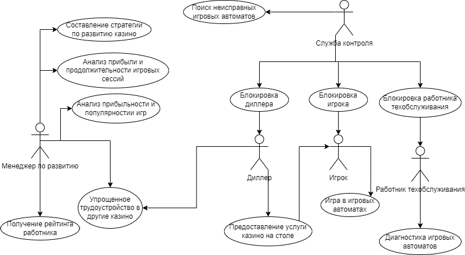
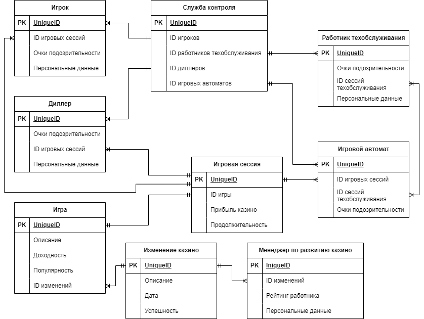

# БД Казино 
#### by Юманов Василий   Б03-313
Проект базы данных включает в себя систему обнаружения мошенников среди работников и игроков казино, а также менеджеров по развитию и их успешность в этой сфере.

База данных предоставляет данные об очках подозрительности каждого игрока и работника в службу контроля, а также предоставляет данные о доходности и популярности игр менеджерам по развитию казино, чтобы те могли максимально эффективно улучшать работу казино.

### Сущности
1. Служба контроля - доверенные физические лица, осуществляющие блокировку пользователей и работников казино.
2. Игрок - физическое лицо, пользующиеся услугами казино.
3. Работник техобслуживания - физическое лицо, проводящие техобслуживание игровых автоматов.
4. Диллер - физическое лицо, предоставляющее услуги казино.
5. Менеджер по развитию - физическое лицо, отвечающее за развитие казино.
6. Игровой автомат - устройство по предоставлению услуг казино.
7. Игровая сессия - процесс предоставления услуг казино игрокам.
8. Игра - тип услуги, предоставляемой казино.
9. Изменение казино - изменение, проводимое менеджером по развитию казино.

### Свойства сущностей
1. Служба контроля
    - Таблица с ID игроков и работников и очками их подозрительности
2. Игрок
    - ID - уникальный идентификатор, необходимый для отслеживания игрока в системе
    - ID игровых сессий - идентификаторы процессов получения услуг казино
    - Очки подозрительности - вероятность того, что данный человек является мошенником
    - Персональные данные - ФИО, необходимое для обвинения игрока в мошенничестве и для блокировки его в казино страны Беларусь
3. Работник техобслуживания
    - ID - уникальный идентификатор, необходимый для отслеживания работника в системе
    - ID сессий техобслуживания - идентификаторы процессов предоставления услуг техобслуживания игровых автоматов
    - Очки подозрительности - вероятность того, что данный человек является мошенником
    - Персональные данные - ФИО, необходимое для обвинения работника в саботаже и для блокировки его в казино страны Беларусь
4. Диллер
    - ID - уникальный идентификатор, необходимый для отслеживания работника в системе
    - ID игровых сессий - идентификаторы процессов получения услуг казино
    - Очки подозрительности - вероятность того, что данный человек является мошенником
    - Персональные данные - ФИО, необходимое для обвинения работника в саботаже и для блокировки его в казино страны Беларусь
5. Менеджер по развитию
    - ID - уникальный идентификатор, необходимый для отслеживания работника в системе
    - ID изменений - идентификаторы процесса изменения работы казино
    - Рейтинг работника - оценка работы менеджера
    - Персональные данные - ФИО, необходимое для составления рейтинга работников казино страны Беларусь
6. Игровой автомат
    - ID - уникальный идентификатор, необходимый для отслеживания аппарата в системе
    - ID игровых сессий - идентификаторы процессов получения услуг казино
    - ID сессий техобслуживания - идентификаторы процессов предоставления услуг техобслуживания игровых автоматов
    - Очки подозрительности - вероятность того, что данный аппарат имеет неисправность
7. Игровая сессия
    - ID - уникальный идентификатор, необходимый для отслеживания процесса предоставления услуг казино в системе
    - ID игры - уникальный идентификатор предоставляемой услуги
    - Прибыль казино - разница между проигранными и выигранными деньгами
    - Продолжительность - сколько времени проходила игровая сессия
8. Игра
    - ID - уникальный идентификатор, необходимый для отслеживания услуги предоставления услуг казино в системе
    - Описание - название услуги, её суть и описание процесса её предоставления/получения
    - Прибыльность - отношение между суммарно проигранными игроками деньгами и суммарно выигранными игроками деньгами
    - Популярность - отношение между временем, проведенным за игрой ко времени существования
9. Изменение казино
    - ID - уникальный идентификатор, необходимый для отслеживания услуги предоставления услуг казино в системе
    - Описание - подробное описание изменения, внесённого в работу казино
    - Дата - дата изменения
    - Успешность - оценка изменения

### Процессы проекта
1) Блокировка игроков
    - Этот процесс включает в себя внесение игрока в "Черный список игроков" казино, ограничивающий право на вход в казино Беларуси.
    - Восстановление доступа проходит через службу контроля путём описания "лазейки", позволяющей получать прибыль из казино.
    - Suppliers: Служба контроля
    - Inputs: Персональные данные игроков, их очки подозрительности
    - Process: Анализ количества очков подозрительности игрока, внесение игрока в черный список
    - Outputs: Черный список игроков
    - Customers: Казино Беларуси
2) Блокировка работников техобслуживания
    - Этот процесс включает в себя внесение работника в "Черный список работников техобслуживания казино", ограничивающий право на трудоустройство в казино Беларуси.
    - Suppliers: Служба контроля
    - Inputs: Персональные данные работников техобслуживания, их очки подозрительности
    - Process: Анализ количества очков подозрительности работника, внесение работника в черный список
    - Outputs: Черный список работников техобслуживания казино
    - Customers: Казино Беларуси
3) Блокировка диллеров
    - Этот процесс включает в себя внесение работника в "Черный список диллеров", ограничивающий право на трудоустройство в казино Беларуси.
    - Suppliers: Служба контроля
    - Inputs: Персональные данные диллеров, их очки подозрительности
    - Process: Анализ количества очков подозрительности работника, внесение работника в черный список
    - Outputs: Черный список диллеров
    - Customers: Казино Беларуси
4) Автоматическая диагностика игровых автоматов
    - Этот процесс включает в себя обнаружение неисправностей в игровых автоматах на основе их очков подозрительности, отправка заявления на техобслуживание неисправных автоматов работникам техобслуживания
    - Suppliers: Служба контроля
    - Inputs: Служба контроля, игровые автоматы
    - Process: Анализ количества очков подозрительности аппарата, внесение в реестр неисправных игровых автоматов, отправка реестра работникам техобслуживания
    - Outputs: список неисправных игровых автоматов
    - Customers: Казино Беларуси
5) Составление проекта об улучшении локальных казино
    - Этот процесс включает в себя анализ популярности и доходности игровых автоматов и игр за столом и составление изменений, которые должны улучшить прибыльность и популярность кокнретного казино.
    - Suppliers: Игры, игровые сессии
    - Inputs: Доходность и популрность игр
    - Process: Анализ доходности, популярности игр и прибыли, продолжительности игровых сессий, вынесение списка измененений, способствующих развитию казино
    - Outputs: Проект об улучшении казино
    - Customers: Казино Беларуси

### UseCase диаграмма

### ER диагрмма
